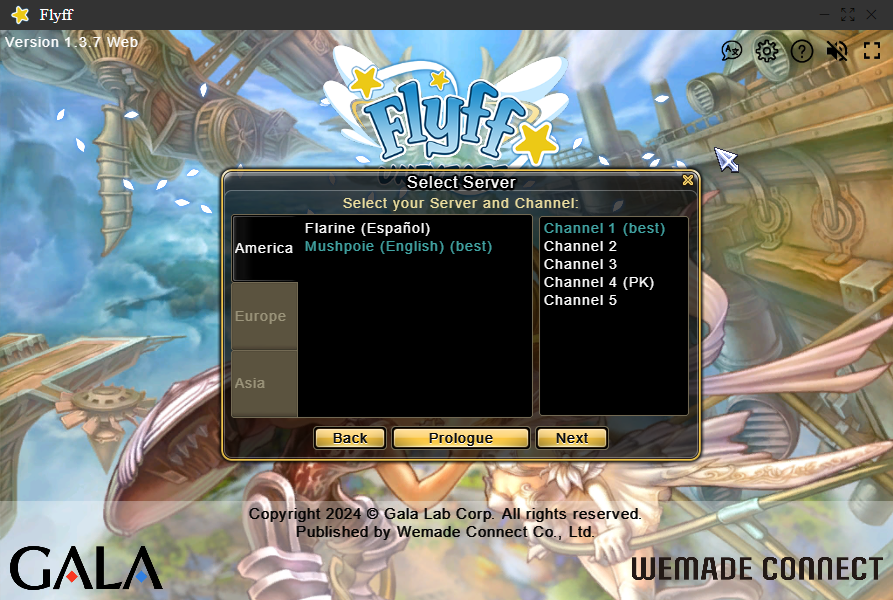

# flyff-launcher
This project provides a custom web-based launcher for playing Flyff Universe, an MMORPG, using Electron. This launcher features a custom title bar with system control buttons (minimize, maximize, close) on the right side and an app icon on the left side.

**Attention: This launcher has only been tested on Windows 10!**

## Prerequisites
Before you can run this project, you'll need to have Node.js installed on your system. You can download and install Node.js from [Node.js official website](https://nodejs.org/).

## Installation
Follow these steps to set up the Flyff Launcher on your system:

### Clone the Repository
First, clone this repository to your local machine using Git:

```bash
git clone https://github.com/shadxn/flyff-launcher.git
cd flyff-launcher

Install Dependencies
Navigate into the project directory and install the necessary dependencies:

npm install electron --save-dev
This command will install Electron and all other dependencies defined in package.json.


This project uses Bootstrap Icons for window control buttons. Install them via npm:

npm install bootstrap-icons
This command adds Bootstrap Icons to your project, allowing you to use the icons as part of your application's UI.
```

## Features
 - Custom Title Bar: Includes custom draggable title bar with minimize, maximize, and close buttons.
 - Bootstrap Icons: Uses Bootstrap Icons for elegant control buttons.
 - External Web Content: Loads the Flyff Universe game directly into the launcher.

## Contributing
 - Contributions are welcome! Feel free to open pull requests or issues to improve the functionality or documentation of this project.

## License
This project is open-source and available under the MIT License.


## Additional Recommendations:

1. **Running the Application**:

     To run the Flyff Launcher, use the shortcut "Flyff.ink" (This shortcut is made for Window) or execute the following command in your terminal:

     ```bash
     npm start
     ```

     This will launch the Electron application with the configured settings.

2. **Screenshots**:
   
